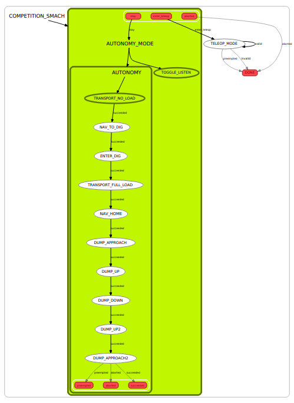

# Package overview

This package is for high level state_machine code for the competition

It is going to have code for a [Finite State Machine][fsm] (usign the ros smach 
package)

Here is an example of a prototype state machine from last year

# About [smach]

Here are some notes from last year:

To view the current state of the smach, run:
`rosrun rqt_smach rqt_smach`
NOTE: If you are running this on your own smach, you must add the
introspection server, see competition_smach.py.

smach is a ROS package that allows you to create state machines, good for
linking together several actions and behaviors in sequence for more complicated
autonomous behavior.  It was used by Willow Garage in their milestone with the
PR2, including being able to [plug itself in][pr2_plugs].

The code for our state machine lives in the `competition_smach.py` file.  The
top level consists of a [Concurrence container][conc] for autonomy and a MonitorState
for teleop.  The Concurrence container allows us to run a MonitorState at the
same time as the main autonomy path.  We listen to the `/teleop_toggle` topic,
and if anything is published to this topic, we abort all of the autonomy
sequence and enter teleop mode.

[ros_action]: http://wiki.ros.org/actionlib
[conc]: http://wiki.ros.org/smach/Tutorials/Concurrence%20container
[smach]: http://wiki.ros.org/smach
[pr2_plugs]: https://github.com/PR2/pr2_plugs
[move_base]: http://wiki.ros.org/move_base
[fsm]: https://en.wikipedia.org/wiki/Finite-state_machine
